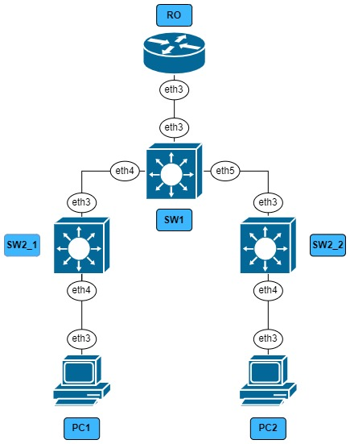

University: [ITMO University](https://itmo.ru/ru/)

Faculty: [FICT](https://fict.itmo.ru)

Course: [Introduction in routing](https://github.com/itmo-ict-faculty/introduction-in-routing)

Year: 2024/2025

Group: K3321

Author: Naderi Mariam Shakhovna

Lab: Lab1

Date of create: 25.09.2024

Date of finished: 28.09.2023

# Лабораторная работ №1 "Установка ContainerLab и развертывание тестовой сети связи"

`Цель работы:`
Ознакомиться с инструментом ContainerLab и методами работы с ним, изучить работу VLAN, IP адресации и т.д.

## Ход работы

Работа выполнялась на ubuntu в виртуальной машине. 

После установки всех необходимых компонентов, с помощью файла .yaml была задана топология трехуровневой сети связи классического предприятия:

