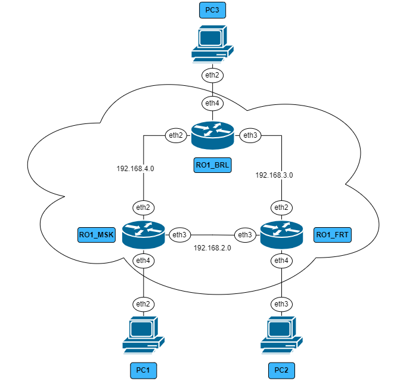
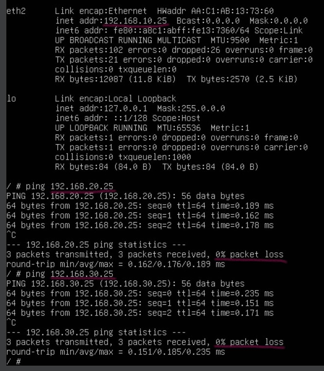
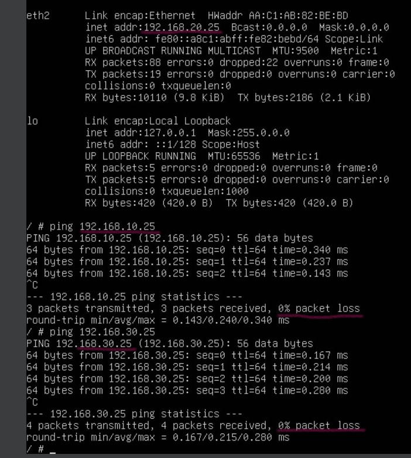

University: [ITMO University](https://itmo.ru/ru/)

Faculty: [FICT](https://fict.itmo.ru)

Course: [Introduction in routing](https://github.com/itmo-ict-faculty/introduction-in-routing)

Year: 2024/2025

Group: K3321

Author: Naderi Mariam Shakhovna

Lab: Lab2

Date of create: 13.10.2024

Date of finished: 16.10.2024

# Лабораторная работ №2 "Эмуляция распределенной корпоративной сети связи, настройка статической маршрутизации между филиалами"

`Цель работы:`
Ознакомиться с принципами планирования IP адресов, настройке статической маршрутизации и сетевыми функциями устройств.

## Ход работы

Работа выполнялась на ubuntu в виртуальной машине. 

После установки всех необходимых компонентов, с помощью файла .yaml была задана топология трехуровневой сети связи классического предприятия:



Далее были настроены все роутеры с помощью следующих команд:
(ssh admin@[ip-адрес]; пароль -- admin)

### RO1_BRL:
```
/ip address
add address=192.168.3.2/30 interface=ether4
add address=192.168.4.2/30 interface=ether3
add address=192.168.30.1/24 interface=ether5

/ip pool
add name=BRL_pool30 ranges=192.168.30.2-192.168.30.25

/ip dhcp-server
add name=BRL_server address-pool=BRL_pool30 interface=ether5 disabled=no

/ip route
add distance=1 dst-address=192.168.10.0/24 gateway=192.168.4.1
add distance=1 dst-address=192.168.20.0/24 gateway=192.168.3.1

```

### RO1_MSK:
```
/ip address
add address=192.168.2.1/30 interface=ether4
add address=192.168.4.1/30 interface=ether3
add address=192.168.10.1/24 interface=ether5

/ip pool
add name=MSK_pool10 ranges=192.168.10.2-192.168.10.25

/ip dhcp-server
add name=MSK_server address-pool=MSK_pool10 interface=ether5 disabled=no

/ip route
add distance=1 dst-address=192.168.20.0/24 gateway=192.168.2.2
add distance=1 dst-address=192.168.30.0/24 gateway=192.168.4.2

```

### RO1_FRT:
```
/ip address
add address=192.168.2.2/30 interface=ether4
add address=192.168.3.1/30 interface=ether3
add address=192.168.20.1/24 interface=ether5

/ip pool
add name=FRT_pool20 ranges=192.168.20.2-192.168.20.25

/ip dhcp-server
add name=FRT_server address-pool=FRT_pool20 interface=ether5 disabled=no

/ip route
add distance=1 dst-address=192.168.10.0/24 gateway=192.168.2.1
add distance=1 dst-address=192.168.30.0/24 gateway=192.168.3.2

```

Настройка PC:
(docker exec -it [id docker] sh)

```
udhcpc -i eth3
ifconfig eth3 up
```

### Результаты пингов: 

На скриншотах видно, что PC имеют друг к другу доступ благодаря маршрутизации, при этом SW2_1 (vlan10) не имеет доступа к PC2 (vlan20), а SW2_2 (vlan20) к PC1 (vlan10).

### RO:


### SW1:


### SW2_1:


### SW2_2:


### PC1:



### PC2:



