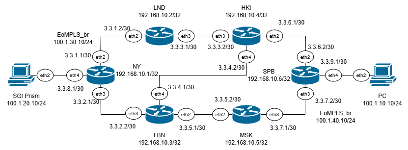
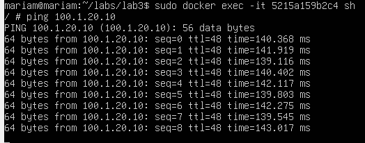

University: [ITMO University](https://itmo.ru/ru/)

Faculty: [FICT](https://fict.itmo.ru)

Course: [Introduction in routing](https://github.com/itmo-ict-faculty/introduction-in-routing)

Year: 2024/2025

Group: K3321

Author: Naderi Mariam Shakhovna

Lab: Lab3

Date of create: 11.11.2024

Date of finished: 13.11.2024

# Лабораторная работ №3 "Эмуляция распределенной корпоративной сети связи, настройка OSPF и MPLS, организация первого EoMPLS"

`Цель работы:`
Изучить протоколы OSPF и MPLS, механизмы организации EoMPLS.

## Ход работы

Работа выполнялась на ubuntu в виртуальной машине. 

После установки всех необходимых компонентов, с помощью файла .yaml была задана топология корпоративной сети связи для компании "RogaIKopita Games":



Далее были настроены все роутеры с помощью следующих команд:
(ssh admin@[ip-адрес]; пароль -- admin)


### RO1_NY:
```
/interface bridge
add name=loopback
add name=EoMPLS_br

/interface vpls
add disabled=no name=EoMPLS remote-peer=192.168.10.6 vpls-id=100:100

/routing ospf instance
set 0 router-id=192.168.10.1
/interface bridge port
add bridge=EoMPLS_br interface=ether5
add bridge=EoMPLS_br interface=EoMPLS

/ip address
add address=192.168.10.1/32 interface=loopback
add address=3.3.1.1/30 interface=ether3 
add address=3.3.2.1/30 interface=ether4
add address=3.3.8.1/30 interface=ether5 
add address=100.1.30.10/24 interface=EoMPLS_br 

/mpls ldp
set enabled=yes lsr-id=192.168.10.1 transport-address=192.168.10.1
/mpls ldp interface
add interface=ether3
add interface=ether4
add interface=ether5
/routing ospf network
add area=backbone 
```

### RO1_LND:
```
/interface bridge
add name=loopback

/routing ospf instance
set 0 router-id=192.168.10.2

/ip address
add address=192.168.10.2/32 interface=loopback 
add address=3.3.1.2/30 interface=ether3
add address=3.3.3.1/30 interface=ether4 

/mpls ldp
set enabled=yes lsr-id=192.168.10.2 transport-address=192.168.10.2
/mpls ldp interface
add interface=ether3
add interface=ether4

/routing ospf network
add area=backbone
```

### RO1_LBN:
```
/interface bridge
add name=loopback

/routing ospf instance
set 0 router-id=192.168.10.3

/ip address
add address=192.168.10.3/32 interface=loopback
add address=3.3.5.1/30 interface=ether3 
add address=3.3.2.2/30 interface=ether4
add address=3.3.4.1/30 interface=ether5

/mpls ldp
set enabled=yes lsr-id=192.168.10.3 transport-address=192.168.10.3
/mpls ldp interface
add interface=ether3
add interface=ether4
add interface=ether5

/routing ospf network
add area=backbone
```

### RO1_HKI:
```
/interface bridge
add name=loopback

/routing ospf instance
set 0 router-id=192.168.10.4

/ip address
add address=192.168.10.4/32 interface=loopback 
add address=3.3.6.1/30 interface=ether3
add address=3.3.3.2/30 interface=ether4
add address=3.3.4.2/30 interface=ether5

/mpls ldp
set enabled=yes lsr-id=192.168.10.4 transport-address=192.168.10.4
/mpls ldp interface
add interface=ether3
add interface=ether4
add interface=ether5

/routing ospf network
add area=backbone
```

### RO1_MSK:
```
/interface bridge
add name=loopback

/routing ospf instance
set 0 router-id=192.168.10.5

/ip address
add address=192.168.10.5/32 interface=loopback 
add address=3.3.5.2/30 interface=ether3
add address=3.3.7.1/30 interface=ether4 

/mpls ldp
set enabled=yes lsr-id=192.168.10.5 transport-address=192.168.10.5
/mpls ldp interface
add interface=ether3
add interface=ether4

/routing ospf network
add area=backbone
```

### RO1_SPB:
```
/interface bridge
add name=loopback
add name=EoMPLS_br

/interface vpls
add disabled=no name=EoMPLS remote-peer=192.168.10.1 vpls-id=100:100

/routing ospf instance
set 0 router-id=192.168.10.6
/interface bridge port
add bridge=EoMPLS_br interface=ether5
add bridge=EoMPLS_br interface=EoMPLS

/ip address
add address=192.168.10.6/32 interface=loopback
add address=3.3.6.2/30 interface=ether3 
add address=3.3.7.2/30 interface=ether4
add address=3.3.9.1/30 interface=ether5 
add address=100.1.30.10/24 interface=EoMPLS_br 

/mpls ldp
set enabled=yes lsr-id=192.168.10.6 transport-address=192.168.10.6
/mpls ldp interface
add interface=ether3
add interface=ether4
add interface=ether5
/routing ospf network
add area=backbone 
```
### PC1:
```
ip add add 100.1.10.10/24 dev eth0
```

### SGI_Prims:
```
ip add add 100.1.20.10/24 dev eth0
```


### Результаты пингов: 

### PC -> SGI Prims:



### SGI Prims -> PC:


### Проверки протоколов: 

### NY:


### LND:


### LBN:


### HKI:


### MSK:


### SPB:


### Трассировка:


