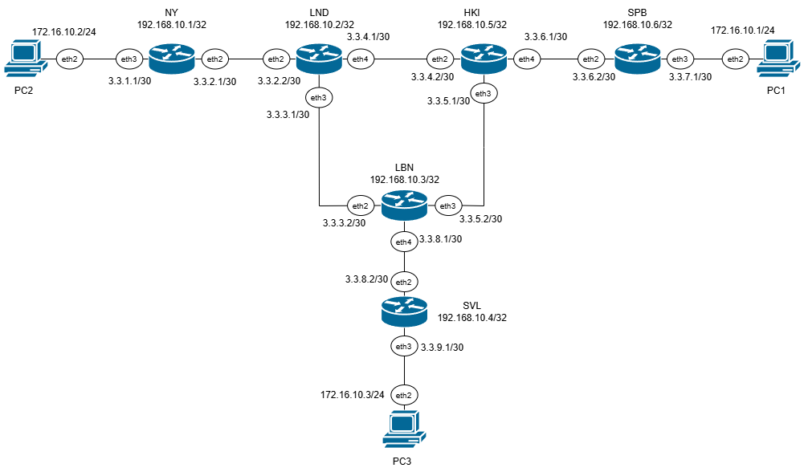
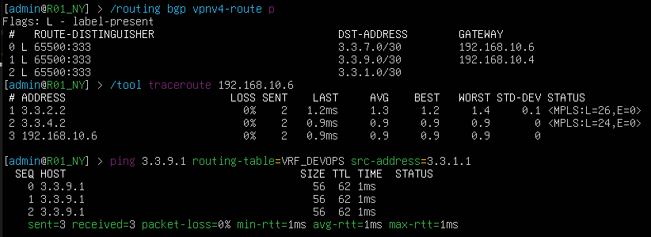
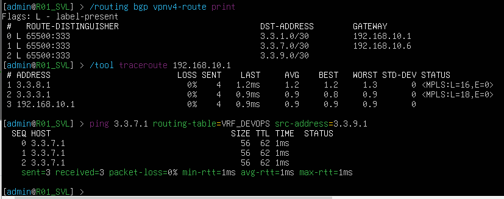
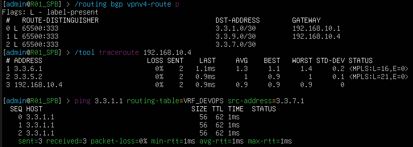

University: [ITMO University](https://itmo.ru/ru/)

Faculty: [FICT](https://fict.itmo.ru)

Course: [Introduction in routing](https://github.com/itmo-ict-faculty/introduction-in-routing)

Year: 2024/2025

Group: K3321

Author: Naderi Mariam Shakhovna

Lab: Lab4

Date of create: 17.12.2024

Date of finished: 

# Лабораторная работ №4 "Эмуляция распределенной корпоративной сети связи, настройка iBGP, организация L3VPN, VPLS"

`Цель работы:`
Изучить протоколы BGP, MPLS и правила организации L3VPN и VPLS.

## Ход работы

Работа выполнялась на ubuntu в виртуальной машине. 

После установки всех необходимых компонентов, с помощью файла .yaml была задана топология корпоративной сети связи для компании "RogaIKopita Games":



Далее были настроены все роутеры с помощью следующих команд:
(ssh admin@[ip-адрес]; пароль -- admin)

## Часть 1

### RO1_NY:
```
/interface bridge
add name=loopback

/ip address
add address=3.3.2.1/30 interface=ether3 
add address=3.3.1.1/30 interface=ether4 
add address=192.168.10.1/32 interface=loopback 

/routing ospf instance
set 0 router-id=192.168.10.1
/routing ospf network
add area=backbone

/mpls ldp
set enabled=yes lsr-id=192.168.10.1 transport-address=192.168.10.1
/mpls ldp interface
add interface=ether3
add interface=ether4

/ip route vrf
add export-route-targets=65500:333 import-route-targets=65500:333 interfaces=ether4 \
    route-distinguisher=65500:333 routing-mark=VRF_DEVOPS

/routing bgp instance
set 0 as=65500 router-id=192.168.10.1
/routing bgp instance vrf
add redistribute-connected=yes redistribute-ospf=yes routing-mark=VRF_DEVOPS
/routing bgp peer
add address-families=vpnv4 name=peer_LND remote-address=192.168.10.2 \
    remote-as=65500 update-source=loopback
```

### RO1_LND:
```
/interface bridge
add name=loopback

/ip address
add address=3.3.2.2/30 interface=ether3 
add address=3.3.3.1/30 interface=ether4 
add address=3.3.4.1/30 interface=ether5 
add address=192.168.10.2/32 interface=loopback 

/routing ospf instance
set 0 router-id=192.168.10.2
/routing ospf network
add area=backbone

/mpls ldp
set enabled=yes lsr-id=192.168.10.2 transport-address=192.168.10.2
/mpls ldp interface
add interface=ether3
add interface=ether4
add interface=ether5

/routing bgp instance
set 0 as=65500 router-id=192.168.10.2
/routing bgp peer
add address-families=vpnv4 name=peer_NY remote-address=192.168.10.1 \
    remote-as=65500 update-source=loopback
add address-families=vpnv4 name=peer_LBN remote-address=192.168.10.3 \
    remote-as=65500 route-reflect=yes update-source=loopback
add address-families=vpnv4 name=peer_HKI remote-address=192.168.10.5 \
    remote-as=65500 route-reflect=yes update-source=loopback
```

### RO1_LBN:
```
/interface bridge
add name=loopback

/ip address
add address=3.3.3.2/30 interface=ether3 
add address=3.3.5.2/30 interface=ether4 
add address=3.3.8.1/30 interface=ether5 
add address=192.168.10.3/32 interface=loopback 

/routing ospf instance
set 0 router-id=192.168.10.3
/routing ospf network
add area=backbone

/mpls ldp
set enabled=yes lsr-id=192.168.10.3 transport-address=192.168.10.3
/mpls ldp interface
add interface=ether3
add interface=ether4
add interface=ether5

/routing bgp instance
set 0 as=65500 router-id=192.168.10.3
/routing bgp peer
add address-families=vpnv4 name=peer_SVL remote-address=192.168.10.4 \
    remote-as=65500 update-source=loopback
add address-families=vpnv4 name=peer_LND remote-address=192.168.10.2 \
    remote-as=65500 route-reflect=yes update-source=loopback
add address-families=vpnv4 name=peer_HKI remote-address=192.168.10.5 \
    remote-as=65500 route-reflect=yes update-source=loopback
```

### RO1_SVL:
```
/interface bridge
add name=loopback

/ip address
add address=3.3.8.2/30 interface=ether3 
add address=3.3.9.1/30 interface=ether4 
add address=192.168.10.4/32 interface=loopback 


/routing ospf instance
set 0 router-id=192.168.10.4
/routing ospf network
add area=backbone

/mpls ldp
set enabled=yes lsr-id=192.168.10.4 transport-address=192.168.10.4
/mpls ldp interface
add interface=ether3
add interface=ether4

/ip route vrf
add export-route-targets=65500:333 import-route-targets=65500:333 interfaces=ether4 \
    route-distinguisher=65500:333 routing-mark=VRF_DEVOPS

/routing bgp instance
set 0 as=65500 router-id=192.168.10.4
/routing bgp instance vrf
add redistribute-connected=yes redistribute-ospf=yes routing-mark=VRF_DEVOPS
/routing bgp peer
add address-families=vpnv4 name=peer_LBN remote-address=192.168.10.3 \
    remote-as=65500 update-source=loopback
```

### RO1_HKI:
```
/interface bridge
add name=loopback

/ip address
add address=3.3.4.2/30 interface=ether3 
add address=3.3.5.1/30 interface=ether4 
add address=3.3.6.1/30 interface=ether5 
add address=192.168.10.5/32 interface=loopback 

/routing ospf instance
set 0 router-id=192.168.10.5
/routing ospf network
add area=backbone

/mpls ldp
set enabled=yes lsr-id=192.168.10.5 transport-address=192.168.10.5
/mpls ldp interface
add interface=ether3
add interface=ether4
add interface=ether5

/routing bgp instance
set 0 as=65500 router-id=192.168.10.5
/routing bgp peer
add address-families=vpnv4 name=peer_LND remote-address=192.168.10.2 \
    remote-as=65500 route-reflect=yes update-source=loopback
add address-families=vpnv4 name=peer_LBN remote-address=192.168.10.3 \
    remote-as=65500 route-reflect=yes update-source=loopback
add address-families=vpnv4 name=peer_SPB remote-address=192.168.10.6 \
    remote-as=65500 update-source=loopback
```

### RO1_SPB:
```
/interface bridge
add name=loopback

/ip address
add address=3.3.6.2/30 interface=ether3 
add address=3.3.7.1/30 interface=ether4 
add address=192.168.10.6/32 interface=loopback 


/routing ospf instance
set 0 router-id=192.168.10.6
/routing ospf network
add area=backbone

/mpls ldp
set enabled=yes lsr-id=192.168.10.6 transport-address=192.168.10.6
/mpls ldp interface
add interface=ether3
add interface=ether4

/ip route vrf
add export-route-targets=65500:333 import-route-targets=65500:333 interfaces=ether4 \
    route-distinguisher=65500:333 routing-mark=VRF_DEVOPS

/routing bgp instance
set 0 as=65500 router-id=192.168.10.6
/routing bgp instance vrf
add redistribute-connected=yes redistribute-ospf=yes routing-mark=VRF_DEVOPS
/routing bgp peer
add address-families=vpnv4 name=peer_HKI remote-address=192.168.10.5 \
    remote-as=65500 update-source=loopback
```

### Результат


### NY


### SVL


### SPB



## Часть 2

### NY

```
/ip route vrf
remove 0

/interface bridge
add name=vpls_br protocol-mode=none

/interface bridge port
add bridge=vpls_br interface=ether4
/interface vpls bgp-vpls
add bridge=vpls_br export-route-targets=1:100 import-route-targets=1:100 name=vpls route-distinguisher=1:100 site-id=2

/ip address
add address=192.168.30.1/24 interface=vpls 

/routing bgp peer
set 0 address-families=l2vpn
```

### LND

```
/routing bgp peer
set 0 address-families=l2vpn
set 1 address-families=l2vpn
set 2 address-families=l2vpn
```

### LBN

```
/routing bgp peer
set 0 address-families=l2vpn
set 1 address-families=l2vpn
set 2 address-families=l2vpn
```

### SVL

```
/ip route vrf
remove 0

/interface bridge
add name=vpls_br protocol-mode=none

/interface bridge port
add bridge=vpls_br interface=ether4
/interface vpls bgp-vpls
add bridge=vpls_br export-route-targets=1:100 import-route-targets=1:100 name=vpls route-distinguisher=1:100 site-id=3

/ip address
add address=192.168.30.4/24 interface=vpls 

/routing bgp peer
set 0 address-families=l2vpn
```

### HKI

```
/routing bgp peer
set 0 address-families=l2vpn
set 1 address-families=l2vpn
set 2 address-families=l2vpn
```

### SPB

```
/ip route vrf
remove 0

/interface bridge
add name=vpls_br protocol-mode=none

/interface bridge port
add bridge=vpls_br interface=ether4
/interface vpls bgp-vpls
add bridge=vpls_br export-route-targets=1:100 import-route-targets=1:100 name=vpls route-distinguisher=1:100 site-id=4

/ip address
add address=192.168.30.6/24 interface=vpls 

/routing bgp peer
set 0 address-families=l2vpn
```


### PC1:
```
ip add add 172.16.10.1/24 dev eth2
```

### PC2:
```
ip add add 172.16.10.2/24 dev eth2
```

### PC3:
```
ip add add 172.16.10.3/24 dev eth2
```


### Результаты пингов: 

### PC1:


### PC2:


### PC3:


